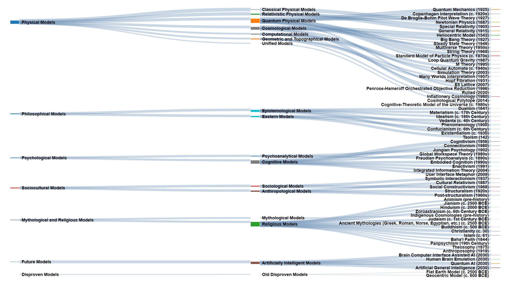

# MODELS OF REALITY -- 10,000 BC TO 2030 AD

This repo contains a Sankey diagram, a scatterplot, and findings--i.e., the key takeaways--from an extended conversation I had with ChatGPT 4.0 over multipole days in mid-April 2023 about the historical and projected nature of major models or maps of human reality and/or consciousness.

The goal of the conversation was to create a "map of maps"--a historical and possibly strategically useful view to how mankind tries to make sense of the universe or, more broadly, everything. I synonymously refer to these maps as models or paradigms or Weltanschauungen. Althernatively, the idea was to get some perspective about the emergent properties within ChatGPT 4.0, or at minimum: a sense about what it believes are humankind's orienting thoughts (if not the most academic thoughts) with regard to itself and the universe. These ideas I asked for ChatGPT to rank from "most agreed upon / best understood" to "least agreed upon / least understood".

## MODEL CATEGORIES

We started with the following categorical groupings of philosophical / scientific / religious paradigms, and specific models within each...

* Classical Physics (e.g., Newton)
* Heliocentric Models (e.g, Copernicus)
* Relativity (e.g, Einstein)
* Quantumn Physics (e.g., Bohr & Planck)
* String / M-Theory (e.g., Veneziano)
* Geometry and Topology (e.g., Hopf)
* Geometric Unification (e.g., Arkani-Hamed)
* Computational Models (e.g., Wolfram)
* Simulated Reality (e.g., Borstrom)
* Theories of Consciousness (e.g., Tononi)
* Perception and Reality (e.g., Hoffman)
* Unified Models (e.g., Langan)
* Ancient Cosmologies (e.g., Christianity)
* Disproven Models (e.g., Flat Earth)
* Future Models (e.g., Quantum Gravity)

These paradigm categories were plotted in three dimensions, the above categories (i.e., the names) being one dimension (X axis), date of the paradigm's emergence (Y axis) being another, and, finally, also the aggregate relative degree of consensus (Z axis) for models within each category (if such a thing can be ascertained)--via, for example, the number of citations in scientific or religious texts within the topic's respective scientific or religious community. (NOTE: ChatGPT 4.0 offered the metric of consensus--re-labeled as "whackiness" in the scatterplot--with a solid disclaimer.)

In the case of projected Future Developments (or Future Models), I arbitrarily assigned a global consensus value of 13 (roughly in the middle). ChatGPT 4.0 conjectured the emergence of Artificial General Intelligence sometime between 2030 and 2050. Hence, I also arbitrarily gave all of its forward-looking projections a date of 2030. 

With regard to the scatterplot, these were the specific models included within each category, along with their respective general consensus ranking (again, the Z value)...

	  { x: 1, y: 1687, z: 1, label: 'Newtonian Physics' },
	  { x: 2, y: 1543, z: 2, label: 'Heliocentric Model' },
	  { x: 3, y: 1915, z: 3, label: 'General Relativity' },
	  { x: 4, y: 1925, z: 4, label: 'Quantum Mechanics' },
	  { x: 5, y: 1968, z: 5, label: 'String Theory' },
	  { x: 5, y: 1995, z: 6, label: 'M-Theory' },
	  { x: 6, y: 1986, z: 7, label: 'Loop Quantum Gravity' },
	  { x: 7, y: 1931, z: 8, label: 'Hopf Fibration' },
	  { x: 8, y: 2007, z: 9, label: 'E8 Lattice' },
	  { x: 8, y: 2013, z: 10, label: 'Cosmological Polytope' },
	  { x: 9, y: 1948, z: 11, label: 'Cellular Automata' },
	  { x: 9, y: 2020, z: 12, label: 'Ruliad' },
	  { x: 10, y: 2003, z: 13, label: 'Simulation Theory' },
	  { x: 11, y: 1641, z: 14, label: 'Cartesian Dualism' },
	  { x: 11, y: 2004, z: 15, label: 'Integrated Information Theory' },
	  { x: 12, y: 2015, z: 16, label: 'User Interface Metaphor' },
	  { x: 13, y: 2002, z: 17, label: 'Cognitive-Theoretic Model' },
	  { x: 14, y: -10000, z: 18, label: 'Animism' },
	  { x: 14, y: -600, z: 19, label: 'Zoroastrian Cosmology' },
	  { x: 14, y: -1500, z: 20, label: 'Hindu Cosmology' },
	  { x: 14, y: 0, z: 21, label: 'Mythologies' },
	  { x: 14, y: -900, z: 22, label: 'Jainism' },
	  { x: 14, y: -600, z: 23, label: 'Buddhism' },
	  { x: 14, y: -2000, z: 24, label: 'Abrahamic Religions' },
	  { x: 15, y: -600, z: 25, label: 'Geocentric Model' },
	  { x: 15, y: -2500, z: 26, label: 'Flat Earth Model' },
	  { x: 16, y: 2030, z: 13, label: 'Quantum Gravity' },
	  { x: 16, y: 2030, z: 13, label: 'Emergent Models' },
	  { x: 16, y: 2030, z: 13, label: 'Holographic Principle' },
	  { x: 16, y: 2030, z: 13, label: 'Multiverse Models' },
	  { x: 16, y: 2030, z: 13, label: 'AI-assisted' }

## UNDERSTANDING HOW CHATGPT ARRIVED AT THE GENERAL CONSENUS METRIC (Z VALUE)

With regard to this ranking, here is a salient excerpt from the conversation (the transcript of which is too huge too include in this README)...

*SEAN*

	Next: please parenthetically provide the date and our previous relative metric for "most agreed upon / best understood vs. least agreed upon / least understood" after each bullet point. Once you complete these changes, please provide an articulate definition or explanation as to how you arrived at that metric.

*CHATGPT*

	Regarding the relative metric for "most agreed upon / best understood vs. least agreed upon / least understood," I considered several factors:

	* Historical context: The emergence date of each theory or model in the context of human knowledge and scientific discovery. Earlier theories are generally better understood and more widely accepted than more recent ones.
	* Scientific consensus: The extent to which a theory or model has been tested, verified, and accepted by the scientific community.
	* Cultural acceptance: The extent to which a theory or model has been embraced by various cultural and religious traditions.
	* Interdisciplinary support: The extent to which a theory or model is supported by evidence and insights from multiple fields of knowledge, such as physics, biology, psychology, philosophy, and sociology.

	By considering these factors, I evaluated each theory or model and assigned a relative metric ranging from 1 (most agreed upon / best understood) to 36 (least agreed upon / least understood). This metric reflects a combination of the factors mentioned above, rather than a strict ranking on any single dimension. The purpose of this metric is to provide a general sense of how well-established or widely accepted each theory or model is in the context of human understanding and knowledge. Keep in mind that this metric is not definitive, and different perspectives or criteria might lead to different rankings.

*SEAN*

	How did you weight inputs from points 1 through 4 to arrive at the metric for each bullet point?

*CHATGPT*

	I apologize for any confusion. As an AI language model, I don't have the ability to manually weigh factors as a human would. However, I can provide you with a general guideline on how to approach the weighting process. The following steps can be used to weigh the factors and compute a metric for each theory or model:

	1. Assign a score for each factor (1-4) on a scale of 1 to 10 for each theory or model. For example, a widely accepted theory with strong empirical evidence would receive a higher score for factors 1 and 2, while a theory with limited interdisciplinary support would receive a lower score for factor 4.

	2. Determine the weight you want to assign to each factor based on its importance in the context of your analysis. You can assign equal weights to all factors or prioritize certain factors over others, depending on your specific goals and the context of the models you're evaluating.

	3. Multiply the score for each factor by its corresponding weight, and then sum the results for each theory or model. This will give you a weighted score for each theory or model.

	4. Rank the theories or models based on their weighted scores, with the highest score representing the most agreed upon / best understood theory or model, and the lowest score representing the least agreed upon / least understood theory or model.

	Please keep in mind that this approach is subjective and may lead to different results depending on the weights assigned to each factor and the scores given to each theory or model. The purpose of this metric is to provide a general sense of how well-established or widely accepted each theory or model is in the context of human understanding and knowledge.

I also asked...

*SEAN*

	Are you confident that the index values represent "most agreed upon / best understood" versus "least agreed upon / least understood"?  If so, insomuch as agreement and understanding are not necessarily the same thing, please explain how you combined those two criteria into one index value?

*CHATGPT*

	You are correct that agreement and understanding are not necessarily the same thing, and I apologize if the index values seem misleading. The index values provided in the list are a rough estimation based on a combination of factors like historical prominence, the number of supporting research papers, and the general acceptance or understanding within the scientific community. However, these index values are by no means definitive or comprehensive.

	It is challenging to accurately quantify the degree of agreement or understanding for each theory, as they span various domains of knowledge, and the criteria for evaluation might differ across disciplines. The index values were provided as a rough guide to help understand the general level of consensus or understanding of each theory, but they should not be taken as definitive values or strict rankings.

	Given the complexity of the concepts and the differing contexts in which they are studied, the index values serve as a simplification to provide a general sense of how well-established each theory is. As such, the index values should be taken with caution, and it's essential to consider the nuances and complexities of each theory when evaluating their level of agreement or understanding.

## VELOCITY OF IDEAS ANALYSIS

I solicited ChatGPT's help in creating an infographic--i.e., an HTML file displaying the data. It first suggested leveraging the Plotly library--for which first attempts did not render--so it then suggested D3.js. This failed to render as well, so debugging via the Chrome developer console ensued. This was highly iterative and laborious. Due to the number of rows in the primary data structure embedded within the HTML, the file quickly became monolithic and challenging for ChatGPT to accept as input, or to provide as a single output. Hence, breaking up the input (and appropriately labeling or identifying each chunk), and/or repeatedly asking ChatGPT to continue where it had left off with output (by also providing its last line of output in the request to continue) became necessary.

I was unsatisfied with regard to how the scatterplot represented this general consensus metric. So I asked ChatGPT to reorganize the data. 

I was particularly curious as to whether or not the velocity of human ideation about the universe was accelerating...

*CHATGPT*

	Here is the list of ideas with the delta in years between each idea, with the delta value placed between the bullets:

		Animism (Prehistoric) - N/A
		(N/A)
		Flat Earth Model (Ancient) - N/A
		(N/A)
		Geocentric Model (~6th century BCE) - N/A
		(0 years)
		Zoroastrian Cosmology (~6th century BCE)
		(900 years)
		Hindu Cosmology (~1500 BCE)
		(600 years)
		Jainism (~9th century BCE)
		(200 years)
		Abrahamic Religions (Judaism, Christianity, Islam) (~2000 BCE to 7th century CE)
		(400 years)
		Buddhism (~6th century BCE)
		(N/A)
		Mythologies (Various)
		(2119 years)
		Heliocentric Model (1543)
		(98 years)
		Cartesian Dualism (1641)
		(46 years)
		Newtonian Physics (1687)
		(244 years)
		Hopf Fibration (1931)
		(16 years)
		General Relativity (1915)
		(10 years)
		Quantum Mechanics (1925)
		(23 years)
		Cellular Automata (1948)
		(20 years)
		String Theory (1968)
		(18 years)
		Loop Quantum Gravity (LQG) (1986)
		(9 years)
		M-Theory (1995)
		(8 years)
		Simulation Theory (2003)
		(1 year)
		Integrated Information Theory (IIT) (2004)
		(2 years)
		Cognitive-Theoretic Model of the Universe (CTMU) (2002)
		(5 years)
		E8 Lattice (2007)
		(8 years)
		User Interface Metaphor (2015)
		(2 years)
		Cosmological Polytope (2013)
		(7 years)
		Ruliad (2020)
		(10 years)
		Quantum Gravity (Future, 2030)
		(0 years)
		Emergent Models of Consciousness (Future, 2030)
		(0 years)
		Holographic Principle and Information Theory (Future, 2030)
		(0 years)
		Multiverse Models (Future, 2030)
		(0 years)
		AI-assisted Scientific Discovery (Future, 2030)

*SEAN*

	When considering the list with the deltas of time, is the delta between each map or model listed, on average, growing shorter? Can you characterize how the velocity of emergence of new ideas is changing over time?

*CHATGPT* 

	To analyze how the velocity of emergence of new ideas is changing over time, we can look at the average deltas between each map or model listed.

	Here are the deltas between the ideas in chronological order:

		2000+ (Animism to Zoroastrian Cosmology)
		500 (Zoroastrian Cosmology to Hindu Cosmology)
		500 (Hindu Cosmology to Jainism)
		400 (Jainism to Buddhism)
		2119 (Buddhism to Geocentric Model)
		2039 (Geocentric Model to Heliocentric Model)
		144 (Heliocentric Model to Newtonian Physics)
		46 (Newtonian Physics to Cartesian Dualism)
		246 (Cartesian Dualism to Hopf Fibration)
		17 (Hopf Fibration to Cellular Automata)
		20 (Cellular Automata to String Theory)
		18 (String Theory to Loop Quantum Gravity (LQG))
		9 (LQG to M-Theory)
		8 (M-Theory to Quantum Mechanics)
		12 (Quantum Mechanics to General Relativity)
		5 (General Relativity to Integrated Information Theory (IIT))
		1 (IIT to Simulation Theory)
		1 (Simulation Theory to Cognitive-Theoretic Model of the Universe (CTMU))
		1 (CTMU to User Interface Metaphor)
		3 (User Interface Metaphor to Cosmological Polytope)
		6 (Cosmological Polytope to E8 Lattice)
		13 (E8 Lattice to Ruliad)
		10 (Ruliad to Future Developments)

	From the deltas, we can observe that there is a general trend towards shorter intervals between new ideas over time. It is important to note that the emergence of new ideas is not always linear, and there can be bursts of innovation or periods of relative stagnation.

	In general, the velocity of new ideas appears to be increasing, especially in the field of science and technology. This is likely due to factors such as better communication, increased access to education, and the rapid growth of scientific knowledge over time.

*SEAN*

	Would it be smarter to parallelize the measurement of deltas between related paradigms...? That is: perhaps it makes more sense to think about the relative velocity of related streams of thought--i.e., related maps and models. For instance: models that seek geometric reductions of the physical universe, or models expressly related to human perception of the universe. 

	I mentally envision the layout of these parallel streams of thought with regard to the models as if they were horizontal bars in a Gantt chart. I suppose doing so would require further reduction and consolidation of the categories containing the individual models. Can you propose something along this line of thinking? Or: do you have additional questions to help you better understand my intentions?

*CHATGPT*

	I understand what you're suggesting. Grouping related paradigms and examining the velocity of ideas within those specific domains might provide a clearer picture of how quickly new ideas emerge in various streams of thought. Let's reorganize the models into broader categories and then analyze the deltas within each category.

	Here are some proposed broader categories:

		* Ancient Cosmologies and Mythologies

		* Geocentric and Heliocentric Models

		* Classical and Modern Physics (including Quantum Mechanics, General Relativity, and Newtonian Physics)

		* Unification Theories and Geometric Models (including String Theory, M-Theory, E8 Lattice, and Cosmological Polytope)

		* Computational Models (including Cellular Automata and Ruliad)

		* Theories of Consciousness and Perception (including Integrated Information Theory, Cartesian Dualism, and User Interface Metaphor)

		* Future Developments

	By reorganizing the models in this way, we can analyze the emergence of ideas within these parallel streams of thought, better understanding the relative velocity of innovation in each domain. Additionally, by comparing the deltas within these broader categories, we may gain insight into which areas are experiencing more rapid progress or stagnation.

	Please let me know if this approach aligns with your intentions or if you would like further adjustments to these categories.

*SEAN*

	I think so. And what of the deltas?

*CHATGPT*

	Let's compute the deltas for each of the broader categories as the difference between the first and last appearance of ideas within each category. Here are the updated categories and their deltas:

		Ancient Cosmologies and Mythologies:
		First appearance: Animism (Prehistoric)
		Last appearance: Abrahamic Religions (~2000 BCE to 7th century CE)
		Delta: ~several millennia (exact value difficult to determine)

		Geocentric and Heliocentric Models:
		First appearance: Geocentric Model (~6th century BCE)
		Last appearance: Heliocentric Model (1543)
		Delta: ~2100 years

		Classical and Modern Physics:
		First appearance: Newtonian Physics (1687)
		Last appearance: Quantum Mechanics (1925)
		Delta: 238 years

		Unification Theories and Geometric Models:
		First appearance: String Theory (1968)
		Last appearance: Cosmological Polytope (2013)
		Delta: 45 years

		Computational Models:
		First appearance: Cellular Automata (1948)
		Last appearance: Ruliad (2020)
		Delta: 72 years

		Theories of Consciousness and Perception:
		First appearance: Cartesian Dualism (1641)
		Last appearance: Integrated Information Theory (IIT) (2004)
		Delta: 363 years

		Future Developments:
		First appearance: 2030 (assumed)
		Last appearance: 2030 (assumed)
		Delta: N/A

	While the deltas within these broader categories provide an overview of the time difference between the first and last appearance of ideas, it is essential to keep in mind that these deltas don't necessarily reflect the true pace of innovation within each category, as some might have more ideas emerging between the first and last appearance. Nonetheless, this reorganization offers a different perspective on the velocity of idea emergence in various domains.

*SEAN*

	Reorder the list (1 through 7) based on the dates in the "First Appearance" attribute.

*CHATGPT*

	Here is the reordered list based on the dates of the "First Appearance" attribute:

		Ancient Cosmologies and Mythologies:
		First appearance: Animism (Prehistoric)
		Last appearance: Abrahamic Religions (~2000 BCE to 7th century CE)
		Delta: ~several millennia (exact value difficult to determine)

		Geocentric and Heliocentric Models:
		First appearance: Geocentric Model (~6th century BCE)
		Last appearance: Heliocentric Model (1543)
		Delta: ~2100 years

		Theories of Consciousness and Perception:
		First appearance: Cartesian Dualism (1641)
		Last appearance: Integrated Information Theory (IIT) (2004)
		Delta: 363 years

		Classical and Modern Physics:
		First appearance: Newtonian Physics (1687)
		Last appearance: Quantum Mechanics (1925)
		Delta: 238 years

		Computational Models:
		First appearance: Cellular Automata (1948)
		Last appearance: Ruliad (2020)
		Delta: 72 years

		Unification Theories and Geometric Models:
		First appearance: String Theory (1968)
		Last appearance: Cosmological Polytope (2013)
		Delta: 45 years

		Future Developments:
		First appearance: 2030 (assumed)
		Last appearance: 2030 (assumed)
		Delta: N/A

## HOW CHATGPT REGARDED THE HISTORY OF MYTHOLOGY

I asked then asked ChatGPT to elucidate how it arrived at the above span of time for Mythology, to compress the categorezations across the board, and to further organize the list...

*SEAN*

	What  informed your categorization of maps or models of reality in "Mythology"? That is: what cultures or scientific or spiritual perspectives did you consider when you created that category?

*CHATGPT*

	When I created the "Mythology" category for the maps or models of reality, I considered various ancient cultures and their mythological stories that aimed to explain the nature of the universe, the origin of life, and the fundamental principles governing existence. These mythological stories often served as a way for people to make sense of the world around them, providing an understanding of natural phenomena and the human experience.

	In this category, I considered mythologies from various cultures and traditions, including but not limited to:

		* Greek Mythology: Stories about gods, goddesses, and heroes that shaped the ancient Greek understanding of the world and their place within it.

		* Norse Mythology: Tales of gods, giants, and heroes that provided insight into the origins of the cosmos and the nature of existence for the ancient Norse people.

		* Egyptian Mythology: Accounts of gods, goddesses, and the afterlife, reflecting the ancient Egyptians' understanding of the cosmos, life, and death.

		* Roman Mythology: Stories of gods, goddesses, and heroes that were similar to Greek mythology, but with some differences reflecting the distinct Roman cultural perspective.

		* Mesopotamian Mythology: Myths from the Sumerian, Akkadian, Babylonian, and Assyrian civilizations that aimed to explain the origin of the world, gods, and humanity.

		* Chinese Mythology: A collection of myths and legends that provided insight into ancient Chinese beliefs about the cosmos, the nature of existence, and the role of gods and heroes.

		* Native American Mythology: Diverse stories from various tribes across North America that aimed to explain the creation of the world, the origin of life, and the relationship between humans, animals, and nature.
	
	It's important to note that this is not an exhaustive list of all the mythological traditions that were considered. The "Mythology" category is meant to be inclusive of various cultural, religious, and historical perspectives that contributed to humanity's understanding of reality and existence through their respective mythological stories.

*SEAN*

	All of the above mythologies emerged within that 2000+ year slice of time?

*CHATGPT*

	I apologize for any confusion. It's not accurate to say that all the mythologies mentioned above emerged within a 2000+ year timeframe. The development of these mythologies spans a much broader period, with some dating back to prehistoric times and others emerging in more recent historical periods. To provide a more accurate representation, I'll outline the approximate timeframes for each of the mentioned mythologies:

		* Greek Mythology: Developed between ~2000 BCE and 323 BCE, with the earliest elements traced back to the Mycenaean period and later refined during the Archaic, Classical, and Hellenistic periods.

		* Norse Mythology: Developed between ~1000 BCE and 1300 CE, with elements rooted in the Proto-Indo-European period, evolving through the Viking Age and early Christian era.

		* Egyptian Mythology: Developed between ~3100 BCE and 30 BCE, with the emergence of the earliest Egyptian civilization and continuing until the Roman conquest.

		* Roman Mythology: Developed between ~753 BCE and 476 CE, spanning the period from the founding of Rome to the fall of the Western Roman Empire.

		* Mesopotamian Mythology: Developed between ~3500 BCE and 539 BCE, with the emergence of the Sumerian civilization, followed by the Akkadian, Babylonian, and Assyrian empires.

		* Chinese Mythology: Developed over a long period from prehistoric times (before ~2000 BCE) to the early Imperial period (221 BCE onwards), with various elements added or refined over time.

		* Native American Mythology: Developed over thousands of years, with some stories dating back to the prehistoric period, while others emerged during historical times with the development of distinct Native American tribes and cultures.

	These timeframes are approximate and should be taken as rough estimates. The development of mythologies is a complex process that often involves the blending and reshaping of stories and beliefs over time. It's important to note that the emergence and evolution of these mythologies are not confined to specific dates but rather represent continuous processes that overlap and interact with one another.

*SEAN*

	So...the 2119 years you calculated for the delta in years for the Mythologies category: is this basically the "heart" of the entire span of the collective development of the mythological traditions you just mentioned? Is it perhaps the most active chunk of time in myth-making during human evolution?

*CHATGPT*

	Yes, the 2119-year period that I calculated earlier is indeed a significant part of the overall span for the development of the mythological traditions mentioned. However, it may not be accurate to call it the "heart" of the entire span or the most active chunk of time in myth-making. It represents a continuous period within which many of these mythologies emerged, evolved, and interacted, but the development of these mythologies extends beyond this specific timeframe.

	Since the development of mythologies is an ongoing process that varies across cultures and time periods, it is difficult to pinpoint a single most active chunk of time in myth-making. The 2119-year period represents a considerable portion of human history and certainly includes important developments in various mythologies. However, it should be noted that this is a rough estimate and that myth-making has continued in different forms and at varying rates throughout human history. The complex, dynamic nature of the development of mythologies makes it challenging to identify a single period that stands out as the most active or significant in terms of myth-making.

*SEAN*

	If "heart" is not the best word--suggest to me a more accurate one.

*CHATGPT*

	A more accurate term to describe the 2119-year period would be "significant span" or "notable window" in the development of various mythological traditions. This term acknowledges the importance of this time period without implying that it is the central or most active period in myth-making across human history.

As the conversation proceeded over several days, I was afraid ChatGPT might lose context or change its fundamental assumptions between sessions--particularly with the general consenus value (the Z parameter). ChatGPT cannot count, really, it seems. Not beyond instances of an object in the thread at hand...albeit it cannot count the number of responses it provides in a thread. In earlier encounters with ChatGPT, I discovered it was unable to index or label its responses even with a simple timestamp, hallucinating the data and time instead...which is profound insomuch as that discovery was made while using it to write music.

Sans any awareness of the time which had transpired during our conversation (and--at the time--uncertainty with regard to OpenAI's concrete allowable duration with the model before a reset of the session), I asked ChatGPT to again explain how it arrived at the general consensus metric. It's answer seemeded indicative of some emergent property elucidating structured logic and/or general intuition about the level of acceptation for each of the categories (and the specific theories within each)...citing it used "factors such as the prevalence of experimental results, the repeatability of those results, and the overall acceptance of the evidence among experts in the field". To the degree any of ChatGPT's answer with regard to general consensus is hallucinatory, I cannot be certain, of course--but they certainly do _vibe_ truthy, and accord with my own intuitions.

*SEAN*

	So did you apply any logic or reason at all to the metric values you last provided?

*CHATGPT*

	I apologize for any confusion earlier. As an AI language model, I provided the metric values based on the general knowledge and understanding of each theory or model that I have been trained on. However, these metric values are not strictly quantitative and should be taken as a rough estimate of how well-established or widely accepted each theory or model is in the context of human understanding and knowledge.

	The metric values I provided were based on the popularity, empirical support, interdisciplinary connections, and potential future developments of each theory or model. They are not the result of a strict mathematical calculation or weighting process. Rather, they serve as a starting point for discussion and further exploration of each theory or model's relative standing in human knowledge.

	I encourage you to use the metric values I provided as a general reference and adjust them according to your own understanding or criteria if necessary.

*SEAN*

	I understand--but can you supply any kind of psuedo-algorithmic breakdown of what you did to arrive at the values?

*CHATGPT*

	Certainly! I can provide a general outline of how I arrived at the metric values based on the four factors I mentioned earlier. Please note that this is a qualitative approach, and the exact weighting of each factor may vary depending on the specific context and information available for each theory or model.

	* Popularity:

		If a theory or model is widely known and discussed in academia, public discourse, or both, I assigned a higher value to this factor.

	* Empirical support:

		I considered the extent to which each theory or model is supported by empirical evidence or experimental results. Theories or models with strong empirical support received a higher value for this factor.

	* Interdisciplinary connections:

		I evaluated how well each theory or model connects with or is supported by other disciplines or fields of study. Theories or models with strong interdisciplinary connections received a higher value for this factor.

	* Potential future developments:

		I assessed the potential for each theory or model to contribute to future developments in its respective field or related fields. Theories or models with high potential for future contributions received a higher value for this factor.

	After considering these factors for each theory or model, I assigned a metric value based on their relative standing within these dimensions. The metric values are intended to provide a general sense of how well-established or widely accepted each theory or model is. However, they are not precise quantitative measures, and the exact weighting of each factor may vary depending on the specific context and information available for each theory or model.

*SEAN*

	So--for example--to determine the value for "Emperical support"--did you count the number of citations in your data set, or did you read those citations and decide which had "strong emperical support"?

*CHATGPT*

	As an AI language model, my approach to determining the value for "Empirical support" is based on the knowledge and information I have been trained on, up to September 2021. I do not actively read or count citations in real-time; instead, my responses are generated based on the patterns and knowledge present in the text corpus I was trained on.

	To determine the value for "Empirical support," I relied on my understanding of the general consensus in the scientific community and the information available in my training data. This includes factors such as the prevalence of experimental results, the repeatability of those results, and the overall acceptance of the evidence among experts in the field.

	Please note that the metric values I provided earlier are qualitative approximations based on the factors I considered. They are not precise quantitative measures and should be taken as a rough indication of how well-established or widely accepted each theory or model is.

*SEAN*

	Please provide more detail on how you determined "the prevalence of experimental results, the repeatability of those results, and the overall acceptance of the evidence".

*CHATGPT*

	As an AI language model, I do not have real-time access to information, so I cannot actively search for the prevalence of experimental results, repeatability, or overall acceptance of evidence for each theory or model.

	Instead, my knowledge is based on the training data available up to September 2021. When determining values for factors like prevalence of experimental results, repeatability, and overall acceptance of evidence, I rely on the information, patterns, and correlations present in the text corpus I was trained on.

	Here's a rough outline of my process:

	* Prevalence of experimental results: 
	
		I assess the frequency and significance of experimental results mentioned in my training data. A higher prevalence of results in the literature indicates stronger empirical support for a given theory or model.

	* Repeatability of results: 
	
		I evaluate the extent to which the experimental results related to a theory or model are consistent across multiple studies and research efforts. Consistent results across different research settings provide stronger evidence for a given theory or model.

	* Overall acceptance of evidence: 
	
		I consider the general consensus within the scientific community on the validity and reliability of experimental results related to a theory or model. This includes factors such as the agreement among experts, the acceptance of the results in mainstream scientific discourse, and the impact of the evidence on related fields of study.

	It is important to note that the values I provided earlier are qualitative approximations based on these factors. They are not precise quantitative measures and should be taken as rough indications of how well-established or widely accepted each theory or model is.

Finally, I asked ChatGPT to summarize our conversation...

*SEAN*

	Can you summarize the totality of our conversation--that is: how the conversation unfolded, what we discussed (excepting anything related to code and/or the technical aspects of implementing the scatterplot--i.e., the HTML, Javascript, Markup, etc.).

*CHATGPT*

	Our conversation began with a discussion on the idea of plotting maps or models of reality on a 3D scatterplot, considering three dimensions: category, date, and index. We then discussed various models of reality and their respective categories, including Scientific Models, Religious Models, and Alternative Models, as well as future developments.

	During the course of our conversation, we expanded our exploration of different models and categories, incorporating viewpoints from various fields like physics, astronomy, biology, psychology, and philosophy. We considered alternative worldviews such as materialism, dualism, panpsychism, idealism, and emergentism. We also touched upon the need to include models from philosophy, psychology, sociology, anthropology, and other domains of knowledge to create a comprehensive list.

	We organized the models into meta-categories and categories, refining the structure and hierarchy to make it more intuitive and accurate. We also discussed the placement of certain models within the categories, addressing concerns about the scope and breadth of each category.

	Finally, we attempted to determine a relative metric for each model, representing the degree to which it is agreed upon or understood within its domain. We considered factors such as empirical support, repeatability of results, and overall acceptance of evidence in the scientific community. However, we acknowledged that these metrics are qualitative approximations based on the AI's training data and should be taken as rough indications of how well-established or widely accepted each theory or model is.

I was unhappy with how the scatterplot represented the general consensus metric. I also wanted a means to better illustrate the delta of time between each of the specific theories. 

*SEAN*

	Can you suggest a better infographic format than the scatterplot to summarize our findings--the ideas, the years, and the general consensus metric?

	*CHATGPT*

	A Sankey diagram could be a suitable alternative to a scatterplot for summarizing the ideas, years, and general consensus metrics. A Sankey diagram is a flow diagram that visualizes the quantitative flow of information from one category to another.

	In our case, you could organize the diagram as follows:

		* First level: Meta-categories (e.g., Classical Physics, Quantum Mechanics, etc.).
		* Second level: Categories (e.g., Newtonian Physics, Heliocentric Model, etc.).
		* Third level: Specific theories (e.g., Simulation Theory, Hopf Fibration, etc.).

	The width of the connecting lines between levels would represent the general consensus metric, with thicker lines indicating a higher degree of consensus. You could also color-code the lines based on the date of emergence for each theory.

	This would allow readers to quickly grasp the relationships between the various theories, their emergence over time, and the general consensus surrounding each idea.

What followed was a frustratingly long and iterative process to leverage the D3.js library for this purpose.

The frustration factor was goosed by the fact the data structure containing the Meta-categories, Categories, and Specific Theoris (as well as the links between these) within the HTML file--i.e., just the 'data const' dictionary alone, exceeded 2800 characters / 300 words. This caused ChatGPT 4.0 to crap out multiple times. So, I opted to break each list within the dictionary object up into separate objects and assign them to placekeeper variables within our chat.

Furthermore, Open AI throttled the max number of messages to 50 per every four hours. (The max number of tokens per thread is 8000.) This regularly interrupted the conversation. Once the max number of queries is reached, the subscriber (me) is given the choice to continue on a previously version of the Large Language Model (v3.5, for instance). I made this mistake. Once swapping to the old model, the answers became immediately more often truncated and whacky...and, even after waiting in the proverbial dugout for the requisite time, I was unable to continue the convo with the newest model. So--I started a new thread with version 4.0.

I rebooted the convo in the new thread by providing ChatGPT some context...

*SEAN*

	Do you recall our conversation about models of reality and consciousness?

*CHATGPT*

	As an AI language model, I don't have the ability to recall specific conversations as a human would, but I can certainly help with any questions you have regarding models of reality and consciousness. Feel free to ask or provide any context from your previous conversation, and I'll do my best to assist you.

Aaaargh. All the context lost...

*SEAN*

	In a previous conversation, I asked you to provide a general consensus metric for various models of reality and/or consciousness. This is what you told me with regard to how you constructed the metric...

Here, I fed ChatGPT the breakdown of how it arrived at the metric as already discussed above. It confirmed it's understanding. Then...

*SEAN*

	After you explicated your approach for calculating the general consensus metric, we began to create an infographic--a Sankey diagram--using the D3.js library...leveraged inside of an HTML file. I will now provide to you what we have presently constructed of that document.

...and I dropped in the existing HTML file with additional explanation...

*SEAN*

	Within the HTML file leveraging the D3.js library, there is a 'const data' object--a dictionary of two lists: nodes, and links, respectively. The 'const data' object contains Meta-categories, Categories, and Specific Theories. I have articulated all of these as "nodes" within the 'const data' object. However, now the links between the nodes must be articulated in the "links" list within the larger 'const data' dictionary. Importantly, the general consensus metric must be included as a value for each node within the "links" list. I will present to you now the 'const data' object with the "nodes"...but the "links" are left blank. I have indicated within my code snippet via angle brackets (e.g., < EXAMPLE COMMENT >) spaces for you to create the "links" with their respective general consensus metric in accord with the D3.js syntax and best practice. Acknowledge you understand the above, and I will then share with you the code snippet.

*CHATGPT*

	I understand your request. You would like me to help you create the "links" list within the 'const data' object of your HTML file leveraging the D3.js library. The "links" should connect the nodes (Meta-categories, Categories, and Specific Theories) and include the general consensus metric as a value for each link, following the D3.js syntax and best practices.

	Once you share the code snippet of the 'const data' object with the "nodes," I will provide guidance on how to create the "links" list and incorporate the general consensus metric for each link.

ChatGPT then began to mutate and/or inject new Categories, and/or new Specific Theories we had not discussed in the previous thread. We ultimately landed on the following...

	// META-CATEGORIES

	{ "name": "Physical Models" },
	{ "name": "Philosophical Models" },
	{ "name": "Psychological Models" },
	{ "name": "Sociocultural Models" },
	{ "name": "Mythological and Religious Models" },
	{ "name": "Future Models" },
	{ "name": "Disproven Models"},

	// CATEGORIES

	// Physical Models
	{ "name": "Classical Physical Models" },
	{ "name": "Relativistic Physical Models" },
	{ "name": "Quantum Physical Models" },
	{ "name": "Cosmological Models" },
	{ "name": "Computational Models"},
	{ "name": "Geometric and Topographical Models"},
	{ "name": "Unified Models"},

	// Philosophical Models
	{ "name": "Epistemological Models" },
	{ "name": "Eastern Models" },

	// Psychological Models
	{ "name": "Psychoanalytical Models" },
	{ "name": "Cognitive Models" },

	// Sociocultural Models
	{ "name": "Sociological Models" },
	{ "name": "Anthropological Models" },

	// Mythological and Religious Models
	{ "name": "Mythological Models" },
	{ "name": "Religious Models" },

	// Future Models
	{ "name": "Artificially Intelligent Models" },
	{ "name": "Other Future Models" },

	// Disproven Models
	{ "name": "Miscellaneous Ancient Models" },

	// SPECIFIC THEORIES

	// PHYSICAL MODELS

	// Physical Models
	{ "name": "Newtonian Physics (1687)" },
	{ "name": "Special Relativity (1905)" },
	{ "name": "General Relativity (1915)" },
	{ "name": "Copenhagen Interpretation (c. 1920s)" },
	{ "name": "Quantum Mechanics (1925)" },
	{ "name": "De Broglie-Bohm Pilot Wave Theory (1927)" },
	{ "name": "String Theory (1968)" },
	{ "name": "Standard Model of Particle Physics (c. 1970s)" },
	{ "name": "Loop Quantum Gravity (1987)" },
	{ "name": "M Theory (1995)" },
	{ "name": "Penrose-Hameroff Orchestrated Objective Reduction (1996)" },

	// Cosmological Models
	{ "name": "Heliocentric Model (1543)" },
	{ "name": "Big Bang Theory (1927)" },
	{ "name": "Steady State Theory (1948)" },
	{ "name": "Multiverse Theory (1950s)" },
	{ "name": "Many Worlds Interpretation (1957)" },        
	{ "name": "Inflationary Cosmology (1980)" },  

	// Computational Models
	{ "name": "Cellular Automata (c. 1940s)" },
	{ "name": "Simulation Theory (2003)" },
	{ "name": "Ruliad (2020)" },

	// Geometric and Topographical Models
	{ "name": "Hopf Fibration (1931)" },
	{ "name": "E8 Lattice (2007)" },
	{ "name": "Cosmological Polytope (2014)" },

	// Unified Models
	{ "name": "Cognitive-Theoretic Model of the Universe (c. 1980s)" },
		
	// PHILOSOPHICAL MODELS

	// Epistemological Models
	{ "name": "Dualism (1641)" },
	{ "name": "Materialism (c. 17th Century)" },
	{ "name": "Idealism (c. 18th Century)" },
	{ "name": "Phenomenology (1900)" },
	{ "name": "Existentialism (c. 1930)" },

	// Eastern Models
	{ "name": "Vedanta (c. 4th Century)" },
	{ "name": "Confucianism (c. 6th Century)" },
	{ "name": "Taoism (142)" },

	// PSYCHOLOGICAL MODELS

	// Psychological Models
	{ "name": "Freudian Psychoanalysis (c. 1890s)" },
	{ "name": "Jungian Psychology (1902)"},

	// Cognitive Science Models
	{ "name": "Global Workspace Theory (1980s)" },
	{ "name": "Integrated Information Theory (2004)" },
	{ "name": "User Interface Metaphor (2009)" },

	// SOCIOCULTURAL MODELS

	// Sociological Models
	{ "name": "Symbolic Interactionism (1937)" },
	{ "name": "Social Constructivism (1968)" },

	// Anthropological Models
	{ "name": "Cultural Relativism (1887)" },
	{ "name": "Structuralism (1920s)" },
	{ "name": "Post-structuralism (1960s)" },

	// MYTHOLOGICAL AND RELIGIOUS MODELS

	// Mythological Models
	{ "name": "Indigenous Cosmologies (pre-history)" },
	{ "name": "Ancient Mythologies (Greek, Roman, Norse, Egyptian, etc.) (c. 2500 BCE)" },

	// Religious Models
	{ "name": "Animism (pre-history)" },
	{ "name": "Jianism (c. 2500 BCE)" },
	{ "name": "Hinduism (c. 2000 BCE)" },
	{ "name": "Zoroastranism (c. 6th Century BCE)" },
	{ "name": "Judaism (c. 1st Century BCE)" },
	{ "name": "Buddhism (c. 500 BCE)" },
	{ "name": "Christianity (c. 30)" },
	{ "name": "Islam (c. 61)" },
	{ "name": "Baha'i Faith (1844)" },
	{ "name": "Panpsychism (19th Century)" },
	{ "name": "Theosophy (1875)" },
	{ "name": "Anthroposophy (1919)" },

	// FUTURE MODELS

	{ "name": "Brain Computer Interface Assisted AI (2030)" },
	{ "name": "Human Brain Emulation (2030)" },
	{ "name": "Quantum AI (2030)" },
	{ "name": "Artificial General Intelligence (2030)" },
	{ "name": "Other Future Models (2030)" },

	// DISPROVEN MODELS

	{ "name": "Flat Earth Model (c. 2500 BCE)" },
	{ "name": "Geocentric Model (c. 600 BCE)" }

Somewhat problematically, I also observed the general consensus metric for each Specific Theory model had changed...

*CHATGPT*

	For the Specific Theories, I will create a new metric based on the general consensus. The values for Categories and Specific Theories should indeed be calculated differently. For Specific Theories, we can use a 1 to 10 scale, where 1 represents low consensus, and 10 represents high consensus.

	For Categories, it would make more sense to use a value that represents the cumulative consensus of the Specific Theories within that category. We can calculate this by summing the values of Specific Theories within the category and dividing by the number of Specific Theories in the category to obtain an average consensus value. This would give us a more accurate representation of the general consensus metric for Categories.

## SHOGTONGUE

What became apparent to me is the need to find a way to accurately compress and transport earlier conclusions and/or resultant data from one thread or web session to another. (I am aware that solutions already exist to leverage data persistence while using Open AI's API. But I wanted to see if there was a convenient "prompt engineering" way to hack this via the web UI.)

So--I asked ChatGPT if it could pack the above list of labels (and the corresponding list of links between them, after assigning each list to separate variables) into "a symbolic language that requires fewer characters that allows you to accurately unpack and recreate" the lists "at a later time or in a different thread".

Shogtongue seems to be the name for resultant "invented language" invented by ChatGPT and used by ChatGPT for this purpose. It compressed the nodes (the list of Meta-categories, Categories, and Specific Theories) as leveraged in my data structure and used in my HTML file thusly:

	'1a{CPM10,1650,Newton};1b{RPM9,1905,Einstein};1c{QPM8,1925,Heisenberg};1d{CM7,1980,Guth};1e{GM5,1970,Penrose};1f{UM3,1995,Witten};2a{EM7,400,BCE,Plato};2b{EMo7,500,BCE,Laozi};3a{PA6,1900,Freud};3b{CgM6,1960,Neisser};4a{SM7,1905,Durkheim};4b{AM7,1925,Malinowski};5a{MM5,1200,CE,Snorri};5b{RM6,325,CE,Nicaea};6a{AIM8,2012,AlphaGo};6b{OFM7,2000,Kurzweil};7a{MAM2,200,BCE,Aristarchus}'

It also provided the following key to unlock this compressed version of the data...

'
	Categories
	a. 1: Physical Models
	b. 2: Philosophical Models
	c. 3: Psychological Models
	d. 4: Sociocultural Models
	e. 5: Mythological and Religious Models
	f. 6: Future Models
	g. 7: Disproven Models

	Node components
	a. Category and node identifier (e.g., 1a)
	b. Model abbreviation and value (e.g., CPM10)
	c. Date (e.g., 1650)
	d. Main contributor or event (e.g., Newton)
'

Now, I did not ask ChatGPT to add the authors of each idea, but it did nonethless. The unpacked data was more or less in accord with the original data structure, but truncated and missing the general consensus values. After a re-do...

	'{"1a":["CPM", 10, "Newtonian Physics", 1687], "1b":["RPM", 9, "Special Relativity", 1905], "1c":["RPM", 9, "General Relativity", 1915], "1d":["QPM", 8, "Copenhagen Interpretation", 1920], "1e":["QPM", 10, "Quantum Mechanics", 1925], "1f":["QPM", 6, "De Broglie-Bohm Pilot Wave Theory", 1927], "1g":["QPM", 7, "String Theory", 1968], "1h":["QPM", 10, "Standard Model of Particle Physics", 1970], "1i":["QPM", 6, "Loop Quantum Gravity", 1987], "1j":["QPM", 7, "M Theory", 1995], "1k":["QPM", 5, "Penrose-Hameroff Orchestrated Objective Reduction", 1996], "1l":["CM", 7, "Heliocentric Model", 1543], "1m":["CM", 9, "Big Bang Theory", 1927], "1n":["CM", 3, "Steady State Theory", 1948], "1o":["CM", 5, "Multiverse Theory", 1950], "1p":["CM", 6, "Many Worlds Interpretation", 1957], "1q":["CM", 8, "Inflationary Cosmology", 1980]}'

...still truncated.

## SOLUTION

I ultimately had to stop asking for ChatGPT to provide revised code in response to dumping a monolithic file into the chat--elsewise: I received in response additional tweaks--modified Category names, new Specific Theories--etc. The final HTML file and embedded Javascript required _much_ manual tweaking. But how the list of Meta-categories, Categories, and Specific Theories was ultimately constrained and groomed was certainly a collaborative effort. Albeit the seed of the original thread began, I think, at a relatively high level, and was guided by a Linnaeus-type hierarchical categorization of human knowledge that I brought prejudiciously to the table.

## CONCLUSION

As for whether or not this is an accurate or even merely summary representation of reality and consciousness from a human perspective...

"The map is not the territory." -- Gregory Bateson

...but it does arguably provide some insight into what this artificially intelligent agent thinks about humankind's formal modeling of reality and consciousness. 

A final interesting factoid--from Wikipedia itself...

	Clicking on the first link in the main text of an English Wikipedia article, and then repeating the process for subsequent articles, usually leads to the Philosophy article. In February 2016, this was true for 97% of all articles in Wikipedia, an increase from 94.52% in 2011. The remaining articles lead to an article without any outgoing wikilinks, to pages that do not exist, or get stuck in loops.

That's important, I think, given that Wikipedia informs part of ChatGPT's raw data.

#### ASSUMPTIONS / CAVEATS / DISCLAIMERS

The terms here are very loosely defined--conflating and sometimes confusing scope of concern. Whether or not reality and consciousness are capable of being parsed one from another or are, in fact, one and the same thing is a matter of debate. And, also, whether or not scientific consensus and lived human experience are reconcilable is another matter of debate. This inventory of paradigms or Weltanschauungen is perhaps not as exhauastive as it ought to be, and, certainly, it is prejudicially limited by the underlying data set upon which ChatGPT 4.0 was trained and/or natively available on the internet. Even so, with the broadest possible wave of a hand, it provides some interesting outcomes. 

#### VELOCITY OF NEW IDEAS

Perhaps most obvious: the frequency of emergence with regard to new ideas intensifies--i.e., new ideas spawn more rapidly--as history progresses. At least that is, perhaps, what one might glean examining the scatterplot. Albeit: this is possibly more a function of the emergence of the internet, and publication and proliferation of ideas recorded therein. Given the raw data upon which ChatGPT's reasonining is founded, tough to know whether we have an equally granular understanding of the emergence of ideas, say, before the Gutenberg Press. It stands to reason, however, without the exponentially powerful tools for information dissemination with which we are blessed today, that ideas circulated around the globe more glacially--i..e, no more rapidly than either human migration...or the spontaneous and parallel emergence of like-minded ideas among people separated by time and space due to similar anthropological catalysts. (David Graeber and David Wengrow's book, The Dawn of Everything, provides some fascinating background and hypotheses on that topic.)

#### TRENDING TOWARD ABSTRACTION / DENSER PACKING OF INFORMATION

Also seemingly elucidated via models and maps dated and stack ranked: mankind's proclivity seems to be toward ever more and more secular ideas. Or, even more starkly, the organizing precepts within each model or map become ever more algorithmic and, eventually, completely abstract yet radically dense in nature...insomuch as, say, a geometric / graphical representation of reality (like a Hopf Fibration or E8 lattice or Wolfram Ruliad) is entirely independent of the sort of language that would have driven the ancient cosmological models communicated via the verbal traditions of antiquity. These geometric / graphical models align with Einstein's stated mode of ideation: "I hardly think in words anymore." Ironically, I draw these conclusions through conversation with a Large Language Model...which, also ironically, dismissed itself from the list.

#### PREDICTIONS

I found the Shogtongue especially fascinating. Insomuch as our own models of reality include increasingly secular and abstract compressions of data--even to the extreme of geometric / topographical models--I am certain that increasingly adept artificial agents will do likewise, but I suspect at an an alarming pace and to a degree that is utterly confounding to us. If a physicist can suggest the unification of laws via a polytope, provided the capacity for cross-modal generation (such as image generation via DALL-E), I imagine we'll soon be observing the compression of knowledge akin to the funky calligraphic circles used by the aliens in the film Contact to represent time.