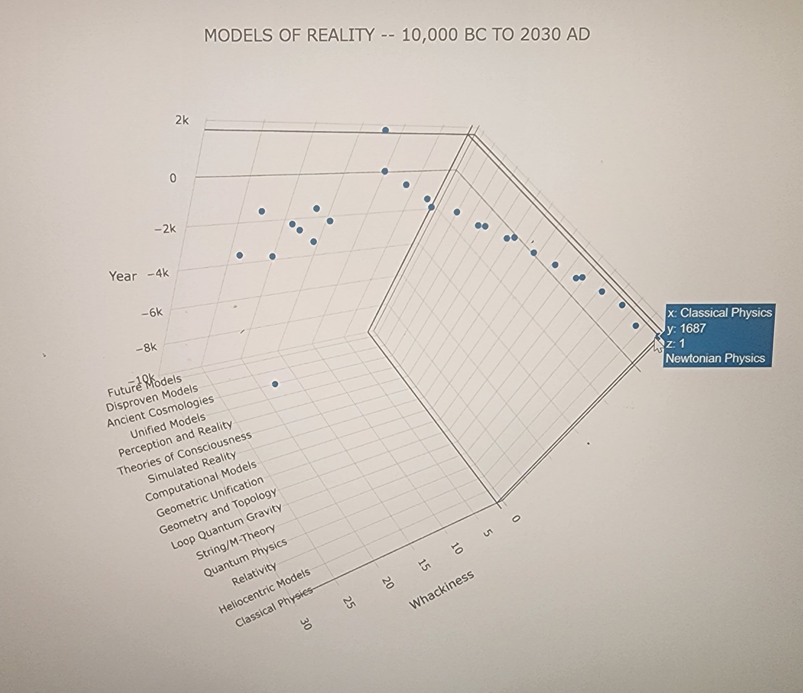

# MODELS OF REALITY -- 10,000 BC TO 2030 AD

This repo contains a scatterplot and findings that summarize the key takeaways from a conversation I had with ChatGPT 4.0 in mid-April 2023 about the historical and projected nature of major models or maps of human reality and/or consciousness.

## CATEGORIES

The following categorical groupings of philosophical / scientific / religious paradigms were discussed.

* Classical Physics (e.g., Newton)
* Heliocentric Models (e.g, Copernicus)
* Relativity (e.g, Einstein)
* Quantumn Physics (e.g., Bohr & Planck)
* String / M-Theory (e.g., Veneziano)
* Geometry and Topology (e.g., Hopf)
* Geometric Unification (e.g., Arkani-Hamed)
* Computational Models (e.g., Wolfram)
* Simulated Reality (e.g., Borstrom)
* Theories of Consciousness (e.g., Tononi)
* Perception and Reality (e.g., Hoffman)
* Unified Models (e.g., Langan)
* Ancient Cosmologies (e.g., Christianity)
* Disproven Models (e.g., Flat Earth)
* Future Models (e.g., Quantum Gravity)

The major paradigms within each of the categories were plotted om three dimensions, the above categories being one dimension (X axis), date of emergence (Y axis) being another, and, finally, also the relative degree of consensus around the idea (if such a thing can be ascertained)--via, for example, the number of citations in scientific or religious texts within the topic's respective scientific or religious community (Z axis). (NOTE: ChatGPT 4.0 offered the metric of consensus--re-labeled as "whackiness" in the scatterplot--with a solid disclaimer.)

In the case of projected Future Developments (or Future Models), I arbitrarily assigned a global consensus value of 13 (roughly in the middle). ChatGPT 4.0 conjectured the emergence of Artificial General Intelligence sometime between 2030 and 2050. Hence, I also arbitrarily gave all of its forward-looking projections a date of 2030. 

## PLOTTED DATA / SPECIFIC MODELS

	  { x: 1, y: 1687, z: 1, label: 'Newtonian Physics' },
	  { x: 2, y: 1543, z: 2, label: 'Heliocentric Model' },
	  { x: 3, y: 1915, z: 3, label: 'General Relativity' },
	  { x: 4, y: 1925, z: 4, label: 'Quantum Mechanics' },
	  { x: 5, y: 1968, z: 5, label: 'String Theory' },
	  { x: 5, y: 1995, z: 6, label: 'M-Theory' },
	  { x: 6, y: 1986, z: 7, label: 'Loop Quantum Gravity' },
	  { x: 7, y: 1931, z: 8, label: 'Hopf Fibration' },
	  { x: 8, y: 2007, z: 9, label: 'E8 Lattice' },
	  { x: 8, y: 2013, z: 10, label: 'Cosmological Polytope' },
	  { x: 9, y: 1948, z: 11, label: 'Cellular Automata' },
	  { x: 9, y: 2020, z: 12, label: 'Ruliad' },
	  { x: 10, y: 2003, z: 13, label: 'Simulation Theory' },
	  { x: 11, y: 1641, z: 14, label: 'Cartesian Dualism' },
	  { x: 11, y: 2004, z: 15, label: 'Integrated Information Theory' },
	  { x: 12, y: 2015, z: 16, label: 'User Interface Metaphor' },
	  { x: 13, y: 2002, z: 17, label: 'Cognitive-Theoretic Model' },
	  { x: 14, y: -10000, z: 18, label: 'Animism' },
	  { x: 14, y: -600, z: 19, label: 'Zoroastrian Cosmology' },
	  { x: 14, y: -1500, z: 20, label: 'Hindu Cosmology' },
	  { x: 14, y: 0, z: 21, label: 'Mythologies' },
	  { x: 14, y: -900, z: 22, label: 'Jainism' },
	  { x: 14, y: -600, z: 23, label: 'Buddhism' },
	  { x: 14, y: -2000, z: 24, label: 'Abrahamic Religions' },
	  { x: 15, y: -600, z: 25, label: 'Geocentric Model' },
	  { x: 15, y: -2500, z: 26, label: 'Flat Earth Model' },
	  { x: 16, y: 2030, z: 13, label: 'Quantum Gravity' },
	  { x: 16, y: 2030, z: 13, label: 'Emergent Models' },
	  { x: 16, y: 2030, z: 13, label: 'Holographic Principle' },
	  { x: 16, y: 2030, z: 13, label: 'Multiverse Models' },
	  { x: 16, y: 2030, z: 13, label: 'AI-assisted' }

## FINDINGS

The topic, again, is "models and maps of reality and/or consciousness".

### ASSUMPTIONS / CAVEATS

The terms here are very loosely defined--conflating and sometimes confusing scope of concern. Whether or not reality and consciousness are capable of being parsed one from another or are, in fact, one and the same thing is a matter of debate. And, also, whether or not scientific consensus and lived human experience are reconcilable is another matter of debate. This inventory of paradigms or Weltanschauungen is perhaps not as exhauastive as it ought to be, and, certainly, it is prejudicially limited by the underlying data set upon which ChatGPT 4.0 was trained and/or natively available on the internet. Even so, with the broadest possible wave of a hand, it provides some interesting outcomes.

### VELOCITY OF NEW IDEAS

Perhaps most obvious: the frequency of emergence with regard to new ideas intensifies--i.e., new ideas spawn more rapidly--as history progresses. At least that is, perhaps, what one might glean examining the scatterplot. Albeit: this is possibly more a function of the emergence of the internet, and publication and proliferation of ideas recorded therein. Given the raw data upon which ChatGPT's reasonining is founded, tough to know whether we have an equally granular understanding of the emergence of ideas, say, before the Gutenberg Press. It stands to reason, however, without the exponentially powerful tools for information dissemination with which we are blessed today, that ideas circulated around the globe more glacially--i..e, no more rapidly than either human migration...or the spontaneous and parallel emergence of like-minded ideas among people separated by time and space due to similar anthropological catalysts. (David Graeber and David Wengrow's book, The Dawn of Everything, provides some fascinating background and hypotheses on that topic.)

To this point about the increasing speed with which new ideas about reality emerge, if we reduce the model categories a bit further, and calculate the delta in time with regard to the first emergence of each and the reign of their proliferation, we get something revealing increasingly plurality and compression of new ideation:

* Ancient Cosmologies and Mythologies:
  * First appearance: Animism (Prehistoric)
  * Last appearance: Abrahamic Religions (~2000 BCE to 7th century CE)
  * Delta: ~several millennia (exact value difficult to determine)

* Geocentric and Heliocentric Models:
  * First appearance: Geocentric Model (~6th century BCE)
  * Last appearance: Heliocentric Model (1543)
  * Delta: ~2100 years

* Theories of Consciousness and Perception:
  * First appearance: Cartesian Dualism (1641)
  * Last appearance: Integrated Information Theory (IIT) (2004)
  * Delta: 363 years

* Classical and Modern Physics:
  * First appearance: Newtonian Physics (1687)
  * Last appearance: Quantum Mechanics (1925)
  * Delta: 238 years

* Computational Models:
  * First appearance: Cellular Automata (1948)
  * Last appearance: Ruliad (2020)
  * Delta: 72 years

* Unification Theories and Geometric Models:
  * First appearance: String Theory (1968)
  * Last appearance: Cosmological Polytope (2013)
  * Delta: 45 years

* Future Developments:
  * First appearance: 2030 (assumed)
  * Last appearance: TBD
  * Delta: N/A

### TRENDING TOWARD ABSTRACTION / DENSER PACKING OF INFORMATION

Also seemingly elucidated via models and maps dated and stack ranked: mankind's proclivity seems to be toward ever more and more secular ideas. Or, even more starkly, the organizing precepts within each model or map become ever more algorithmic and, eventually, completely abstract yet radically dense in nature...insomuch as, say, a geometric / graphical representation of reality (like a Hopf Fibration or E8 lattice or Wolfram Ruliad) is entirely independent of the sort of language that would have driven the ancient cosmological models communicated via the verbal traditions of antiquity. These geometric / graphical models align with Einstein's stated mode of ideation: "I hardly think in words anymore." Ironically, I draw these conclusions through conversation with a Large Language Model...which, also ironically, dismissed itself from the list.